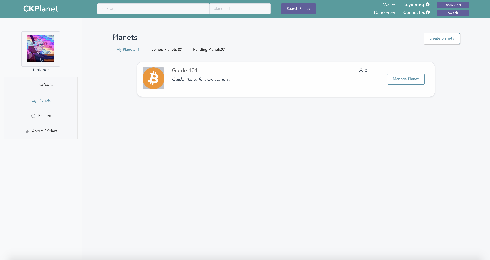

# CKPlanet 

## About CKPlanet

CKPlanet is an UGC dapp, where user can share their knowledge on planets. CKPlanets use service called [CKDataBase](https://github.com/timfaner/CKplanet/tree/master/file-server) to ensure users' data stored safely in third party.   
The  demo page is [here](https://unipass.mulanlicense.com/#/) (open in chrome).

##  Content of repo

- [front](https://github.com/timfaner/CKplanet/tree/master/front)  
Web ui of CKPlanet

- [file-server](https://github.com/timfaner/CKplanet/tree/master/file-server)  
CKDataBase

- [contract](https://github.com/timfaner/CKplanet/tree/master/contract)   
contract to ensure data intergrity and record CKDataBase info.

- [dapp-server](https://github.com/timfaner/CKplanet/tree/master/dapp-server)  
A simple ws server to relay applys and approvals in ckplanet.

## 