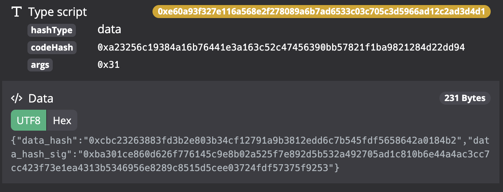

## DataServer_info

### 逻辑
1、检查output_data中各个字段的值是否符合格式  
 
- dataserver_ip 为正确的 地址 协议+域名+端口号  协议为 `http://` 或 `https://`
- access\_token\_public  检查是否为 十六进制字符串 前缀 为0x
- access\_token\_public\_pk  检查是否为 十六进制字符串 前缀 为0x

2、检查scipt 为type_script

### args
- dataserver_info 的 args 为 app\_id，每个app\_id 对应一个使用存储服务的app
-  app_id 为 **ascii字符**


字段名称 | 字段长度 (bytes) | 是否必须有 | 用途| 示例
-------|--------|:----:|---------|-----
app_id | 1-10 |  是|  app 标识 |CKplanet 、DeepChat

#### 示例  

- 编码之前的数据（链上存的数据)  
```
ckplanet
```

- 编码之后的数据  

```
0x636b706c616e6574
```

### outputs_data
json 格式字符串，使用utf-8编码，有如下字段：

- dataserver_ip 协议+域名+端口号 
- access\_token\_public  十六进制字符串 前缀 为0x
- access\_token\_public\_pk 十六进制字符串 前缀 为0x


字段名称 | 字段类型  | 是否必须有 | 用途| 示例
-------|--------|:----:|---------|-----
dataserver_ip | string |  是|  数据服务器访问地址 | http://data_server.ckplanet.com:8181，https://123.12.33.12:8181
access\_token\_public | string |是 | 公开数据访问token | 0xd81212 (长度不定) 
access\_token\_public\_pk | string | 是 | access\_token\_public 对应pk | 0x1212 (长度不定) 

#### 示例 


- 编码之前的数据 
```json
{"dataserver_ip":"http://ckplanet.beihanguni.cn:8081/http://ckplanet.beihanguni.cn:8080","access_token_public":"0xd8353e4d2ca95a5eef46d2d4d74ac5efca754a32cae54682f2f6923f7dc372bc1a9a6dd3fa9f720504c3cab1f7bcb86cba09f4a6cd0272752a6c55cfb27fba83","access_token_public_pk":"0x038dbc8452781346ffc0b170d12d89f5a5dcd89bcd783e2ac379eb01c511f3e409"}
```

- 编码之后的数据 
```
0x7b22646174617365727665725f6970223a22687474703a2f2f636b706c616e65742e62656968616e67756e692e636e3a383038312f687474703a2f2f636b706c616e65742e62656968616e67756e692e636e3a38303830222c226163636573735f746f6b656e5f7075626c6963223a2230786438333533653464326361393561356565663436643264346437346163356566636137353461333263616535343638326632663639323366376463333732626331613961366464336661396637323035303463336361623166376263623836636261303966346136636430323732373532613663353563666232376662613833222c226163636573735f746f6b656e5f7075626c69635f706b223a223078303338646263383435323738313334366666633062313730643132643839663561356463643839626364373833653261633337396562303163353131663365343039227d
```

### 示例


## Data_intergerity
### 逻辑

1、检查output_data中各个字段的值是否符合格式  
 
- data_hash  检查是否为 十六进制字符串 前缀 为0x
- data\_hash\_sig  检查是否为 十六进制字符串 前缀 为0x


2、检查scipt 为type_script

### args

 - data_intergerity 的 `args` 为 数据id , 每个 数据id 对应该` lock_script`拥有者的的一个数据。  
 
 - id 由data\_id , cycle\_id , content\_id 拼接而成，中间用 `冒号`链接。各个字段均为**ascii字符**.   

字段名称 | 字段长度(bytes) | 是否必须有 | 用途| 示例
-------|--------|:----:|---------|-----
data_id | 1~3 |  是| 数据的种类|12 、 dv 、 1D 
cycle_id | 4 | 否| 代表|aUfc 、 EdwS
content_id | 6 | 否，如果有则必须有cycle_id 字段||arLdgr、 Efssef
id | 1~15 | 是||12:wefE:sfwSfv 、 12:EdwS 、 12
 
#### 示例  

- 编码之前的数据  
```
1
```

- 编码之后的数据  

```
0x31
```

###  outputs_data

json 格式字符串，使用utf-8编码，有如下字段：


- data_hash  十六进制字符串 前缀 为0x
- data\_hash\_sig 十六进制字符串 前缀 为0x


字段名称 | 字段类型  | 是否必须有 | 用途| 示例
-------|--------|:----:|---------|-----
data_hash | string |  是|  id对应数据的hash |  0xdes
data\_hash\_sig | string |是 | data_hash的签名 | 0xd81212 (长度不定) 


#### 示例 


- 编码之前的数据 
```json
{"data_hash":"0xcbc23263883fd3b2e803b34cf12791a9b3812edd6c7b545fdf5658642a0184b2","data_hash_sig":"0xba301ce860d626f776145c9e8b02a525f7e892d5b532a492705ad1c810b6e44a4ac3cc7cc423f73e1ea4313b5346956e8289c8515d5cee03724fdf57375f9253"}
```

- 编码之后的数据 
```
0x7b22646174615f68617368223a22307863626332333236333838336664336232653830336233346366313237393161396233383132656464366337623534356664663536353836343261303138346232222c22646174615f686173685f736967223a2230786261333031636538363064363236663737363134356339653862303261353235663765383932643562353332613439323730356164316338313062366534346134616333636337636334323366373365316561343331336235333436393536653832383963383531356435636565303337323466646635373337356639323533227d
```

### 示例

